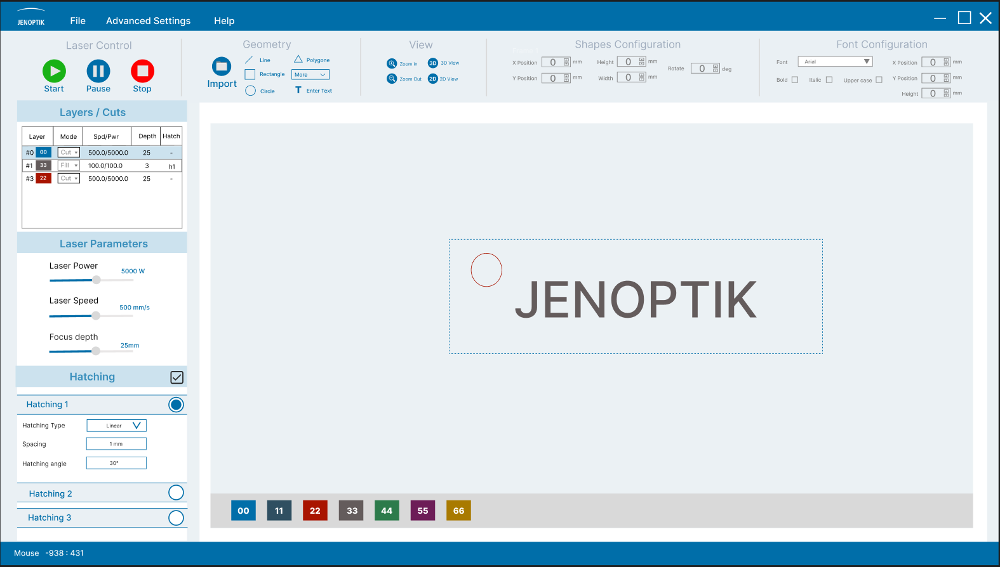
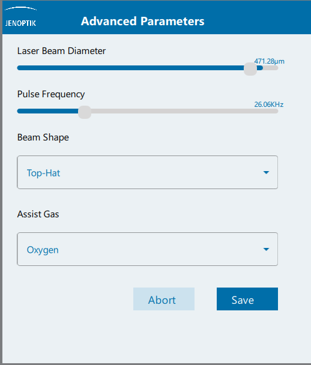
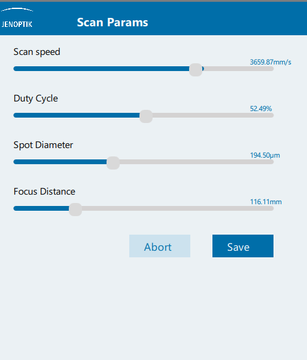
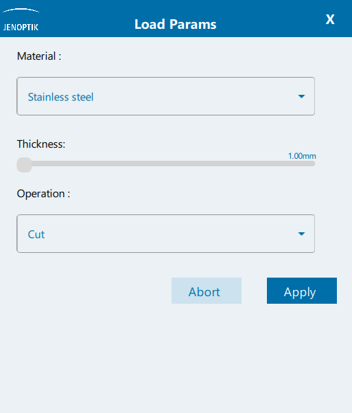

# Jenoptik Laser Machine Controller
**Jenoptik Laser Machine Controller** is a Qt-based application developed for managing and configuring laser machine parameters. 
It provides a GUI for setting up process parameters of laser machines, including advanced laser parameters and scanning parameters. 
The software allows users to select the material type and thickness to auto-generate relevant parameters.

## Features

- Set up basic laser parameters.
- Adjust advanced laser parameters.
- Manage scanning parameters.
- Auto-generate parameters based on material type and thickness.

## Installation

Follow these steps to install the application:

1. Ensure you have the Qt development environment (version 6.2.0 or higher) and CMake installed on your system. You can download Qt from [here](https://www.qt.io/download-open-source) 
2. Clone this repository to your local machine using [`git clone https://github.com/amriadam/Jenoptik.git `].
3. Open the project in Qt Creator.
4. Click the green "Run" button to build and run the project.

## Usage

To use this application, run it through the Qt Creator and navigate through the GUI to adjust laser parameters, advanced laser parameters, and scanning parameters. 
You can also select the material type and thickness to auto-generate the relevant parameters.

## Dependencies

This application depends on the following Qt components:

- Qt::Core
- Qt::Gui
- Qt::Quick
- Qt::Qml
- Qt::Sql

